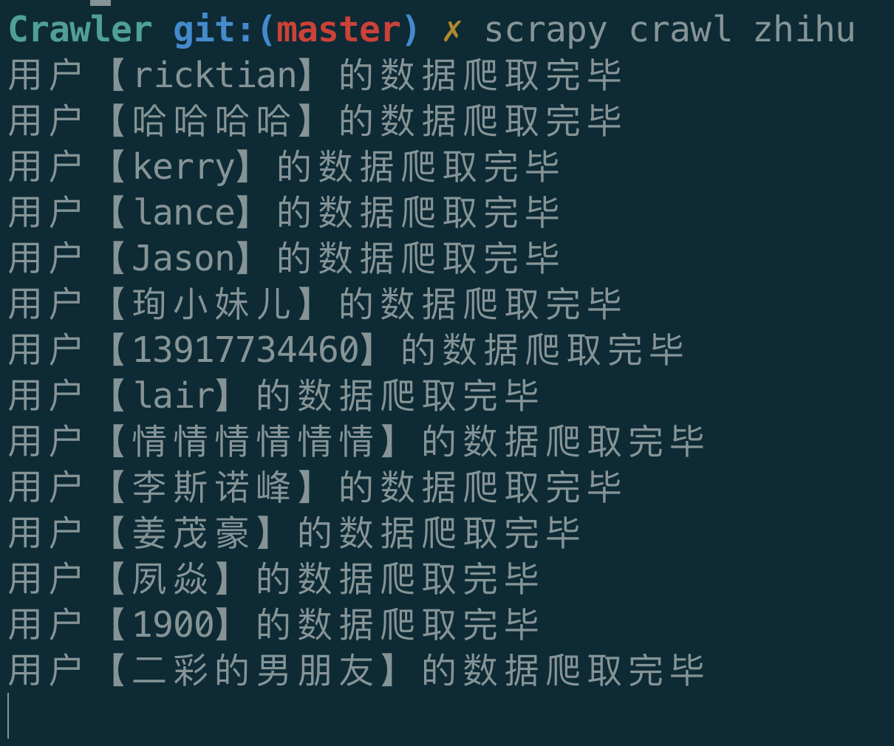
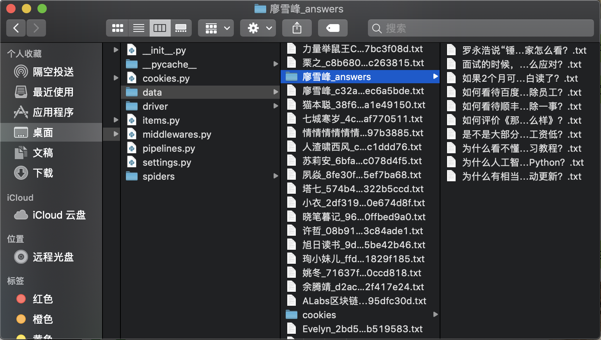
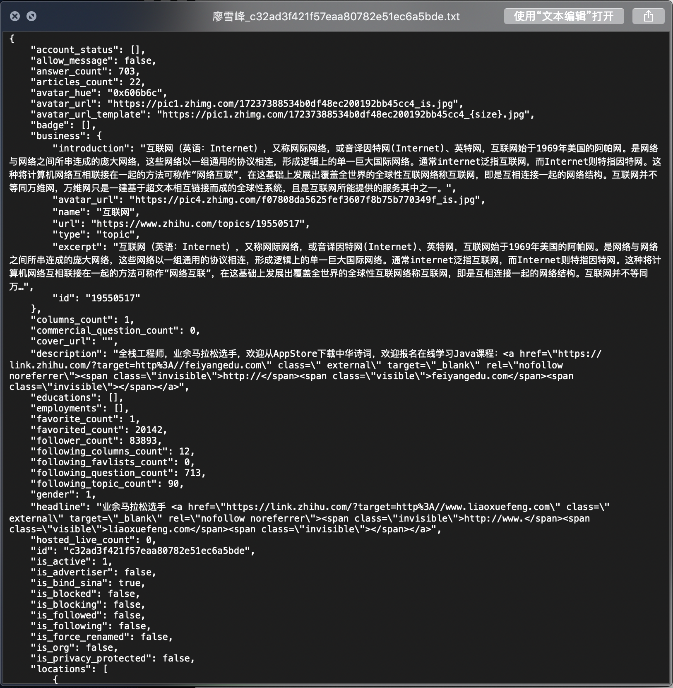
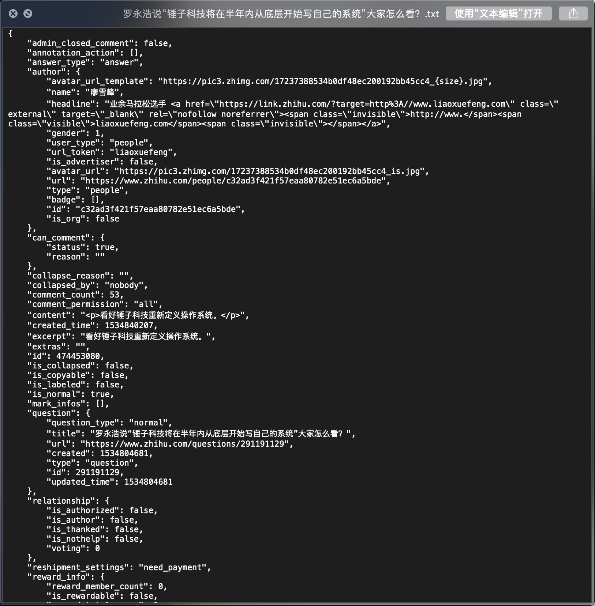

# 简易知乎爬虫，爬取知乎用户信息和回答

- 基于Selenium和Scrapy
- 从一个大V用户出发，递归爬取其关注和被关注列表的其他用户信息，以及其回答（按照点赞数排名靠前10个）
- 目前默认大V：廖雪峰@liaoxuefeng

## 特点

- 从特定用户出发，通过关注列表递归爬取用户信息和回答
- 需要登录（采用selenium）获得cookie
- 初步的反反爬虫
  - 多个IP代理，在爬虫期间随机使用代理请求数据
    - 可以在settings.py中修改IP_LIST，加入可用的ip；
    - 如果IP列表中没有内容，将会默认用本机IP爬取数据。
  - 多个User-Agent代理，模拟浏览器操作
    - 使用Fake_useragent库，随机给请求加入代理头。
- 断点续爬 & 去重
  - 采用数据库的情况下，每次插入数据前将会自动进行去重操作；
  - 采用文件存储时，将会检测data目录下是否已经有该文件，从而实现去重。

## 使用

- 启动：

  - 直接使用：进入第二层ZhihuCrawler目录，所有数据将会保存在项目内data文件夹下，其中个人信息和回答信息将会分开存放（详见下文中结果部分）
  - 数据库：需要安装mongodb数据库。请在setting.py中修改以下内容以获得数据库支持：

  ```python
  MONGO_URI = 'URI of your mongodb'	# 你的数据库URI
  DB_NAME = 'zhihu'					# 你的数据库名称
  USE_DB = True						# 修改成True，数据将会存储到数据库而不是本地文档
  ```

  - 输入：`scrapy crawl zhihu`

- 过程：

  - 如果运行正常，第一次运行的时候你将会看到一个弹出的Chrome页面，提示你扫码登录知乎获得Cookie。
    - 如果出现错误，请确认你的系统有geckodriver——在项目的driver文件夹下有macOS版本的文件，其他系统可以在官网找到文件。
  - 在控制台敲入回车，开始爬虫……

## 运行结果截图

- 控制台运行截图

  

- 文件夹截图

  

- 用户信息文件截图

  

- 用户回答截图

  